# banking-report-etl-powerquery
Excel Power Query ETL pipeline that imports, transforms, and standardizes multiple simulated banking txt-based daily reports into structured datasets for reporting and analysis.

## 📊 Banking Report ETL Pipeline (Excel Power Query)
### 📌 1.Overview

This project is a Power Query-based ETL pipeline designed to simulate a real-world banking reporting system. It processes multiple structured txt-based reports, transforms them into clean datasets, and prepares them for analysis in Excel.

The solution demonstrates how Excel can be used as a lightweight data engineering tool for batch report processing.

**⚠️ Data Disclaimer**

All the seven txt-based datasets in this project are synthetically generated banking-style reports used for testing and educational purposes. No real financial or customer data is included.

### 🏗️ 2. Architecture

Raw TXT Files (Folder)  
        ↓       
Power Query Folder Connector  
        ↓        
File Inventory Table (Metadata Layer)  
        ↓        
Report-Specific Transformations  
        ↓        
Structured Excel Tables

### 📁 3. Input Data

The pipeline processes the following simulated banking reports:

   - Customer Loan Portfolio Report  
   - Loan Repayment Due Report  
   - Delinquent Loan Report  
   - Mortgage Portfolio Report  
   - Loan Disbursement Report  
   - Customer Account Summary Report  
   - Daily Loan Transaction Report  
 
### ⚙️ 4. Key Features
  - Folder-based dynamic file ingestion using Power Query
  - Parameterized file path for flexible daily data switching
  - Automated parsing of semi-structured TXT reports
  - Rule-based classification approach to seperate data body from header and footer

  - Standardization of:  
    - Dates: eg, from 28-Jun-2026 to 01/06/2026
    - Numeric values: from text to whole number and/or decimal number
    - Column naming conventions
    - Separation of metadata (headers/footers) from transactional data: dynamically identify rows starting with characters of interest 
    - Fully refreshable ETL pipeline (single-click refresh): parameter setup
    
### 🔄 5. Workflow
  - New daily reports are downloaded into a folder
  - Folder path is set via a Power Query parameter
  - Excel “Refresh All” triggers ingestion and transformation
  - All datasets update automatically
    
### 📊 6. Output

Clean, structured Excel tables ready for:
  - PivotTables
  - Dashboards
  - Financial reporting
  - Power BI integration
  - Data analysis
    
### 🛠️ 7. Tools Used
  - Microsoft Excel
  - Power Query (M Language)
  - ETL Design Principles
  - Data Cleaning & Transformation
  - Folder-based Data Ingestion
    
### 🚀 8. Key Achievement

This project eliminates manual report processing by implementing an automated ETL workflow. The system enables scalable ingestion of multiple banking-style reports with minimal user intervention.

### 📸 9. Screenshots (Recommended)

**Folder query view**
 
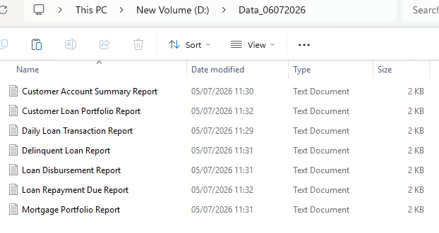 
 
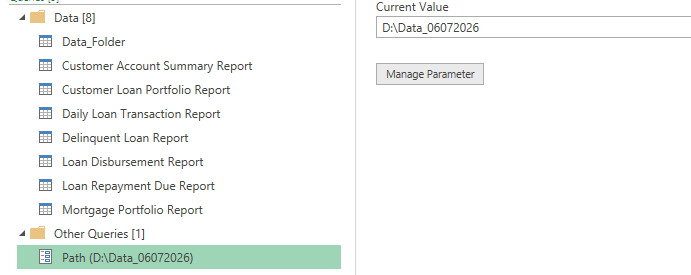 
 
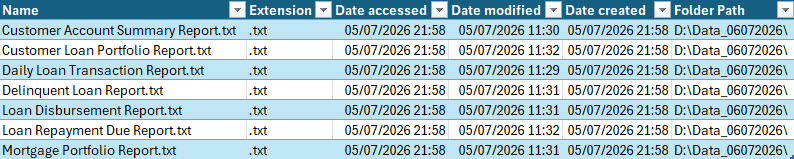 
 

**Final transformed tables**
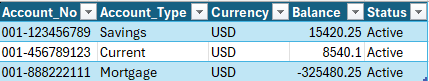  
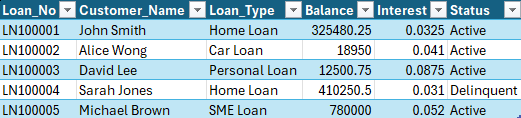  
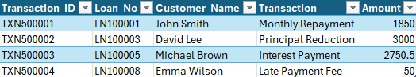  
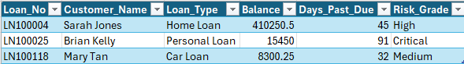  
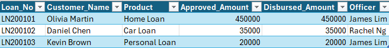  
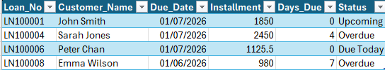  
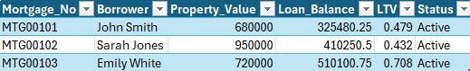  
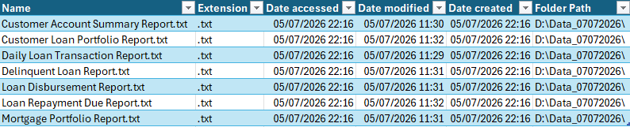  

Power Query steps

Refresh output
👨‍💻 Author

Your Name
Data Analyst / Aspiring Data Engineer
