# Banking-Report-ETL-PowerQuery
Excel Power Query ETL pipeline that imports, transforms, and standardizes multiple simulated banking txt-based daily reports into structured datasets for reporting and further analysis.

## 📊 Banking Report ETL Pipeline (Excel Power Query)
### 📌 1. Overview

This project is a Power Query-based ETL pipeline designed to simulate a real-world banking reporting system. It processes multiple structured txt-based reports, transforms them into clean Excel tables, and prepares them for further analysis in Excel.

The solution demonstrates how Excel can be used as a lightweight data engineering tool for batch report processing. Key steps ate one parameter change and on Refresh All instead of regular manual Text Import Wizard steps for every report.

**⚠️ Data Disclaimer**

All the seven txt-based datasets in this project are synthetically generated banking-style reports used for testing purposes. They simulate similar format of reports data as I worked with. No real financial or customer data is included.

- **The Problem**
I worked in an operational admin team, downloaded seven daily reports from system and processed them using Excel for analysis. Each report was prepared in the following way,
     1. Open the txt-based file in Excel.
     2. Text Import Wizard,
        - step 1: choose Fixed width
        - step 2: click to place column break lines at the right character positions
        - step 3: set the data format of each column
        - Finish
     3. Delete the report header and footer by hand. Or re-format and/or calculate columns as required.

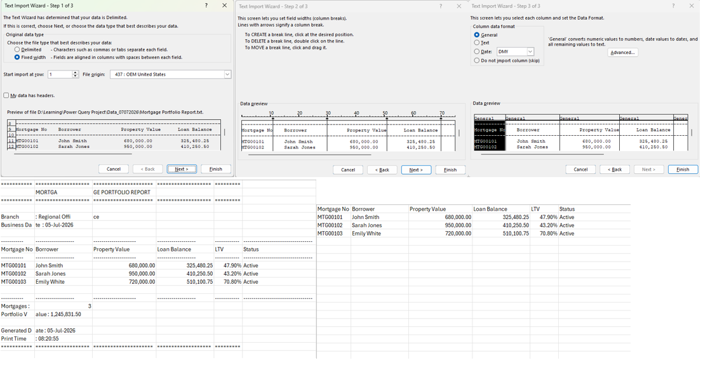

The above steps were repeated for seven reports each business day by hand. The break lines and formats have to be set again each time and different staff placed the break lines and formatted columns in various ways, which lacked in consistency.

- **Why Power Query** 
The operations team has no access to SQL, Python or other data processing tools, and uses Excel in administrative level. Built into Excel, Power Query facilitates daily process of data import and manipulation by one parameter change and one click of Refresh All, with no coding needed to run the process.

- **The Solution** 
A pipeline by Power Query is created in one Excel workbook with following methods:
     - creates defined parameter **Path** to the folder for current working day, such as ~./14102026
     - reads each report from the day's folder -- 14102026
     - creates Target Rows Indicator for data rows, and drops header rows, footer rows and non-data rows
     - splits the fixed-width lines of data into columns based on position, trims the text, applies appropriate data types and renames columns
     - loads each report to its own sheet for further analysis

Comparison between Manual Steps and Power Query is listed in the following table, 
||Manual Steps (Before)|Power Query (After)|
|---|---|---|
| Per Report| Multiple Manual Steps in the wizard| None|
| Column Position and Types| Set Daily| Defined once in the Query|
| Header and Footer Removal| Delete by hand| Removed by rules|
| Daily Action| Repeat for 7 Reports| Change parameter "Path", then Refresh All|
  
### 🏗️ 2. Architecture

Raw TXT Files (Folder)  
        ↓       
Power Query Folder Connector  
        ↓        
File Inventory Table (Metadata Layer)  
        ↓        
Report-Specific Transformations  
        ↓        
Structured Excel Tables

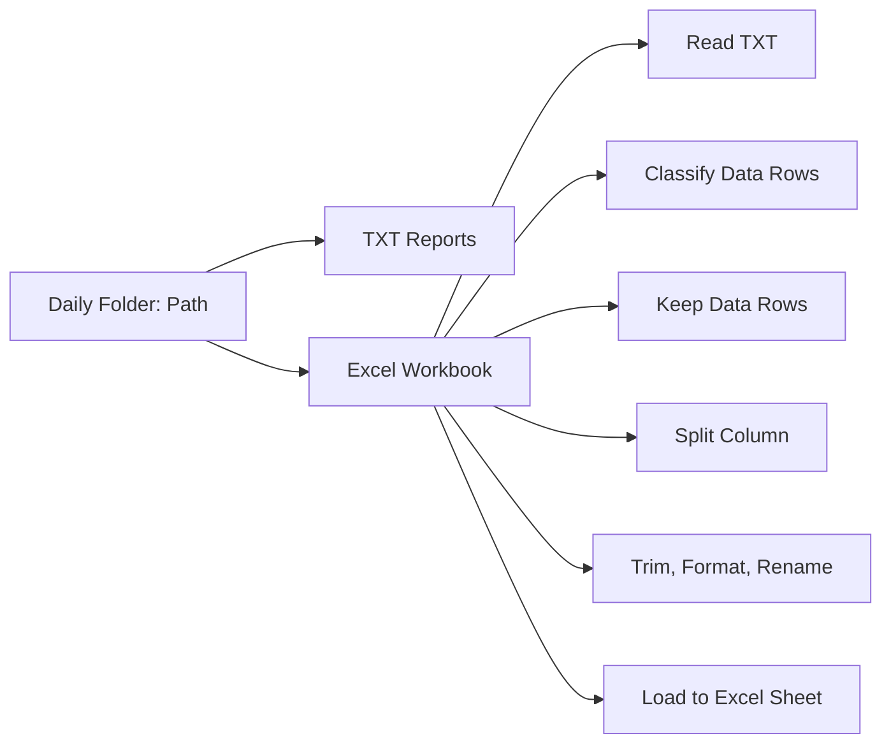
```mermaid
graph LR;
A[Daily&nbsp;Folder:&nbsp;Path] --> B[TXT Reports];
A[Daily&nbsp;Folder:&nbsp;Path] --> C[Excel Workbook];
C[Excel Workbook] --> D[Read TXT];
C[Excel Workbook] --> E[Classify Data Rows];
C[Excel Workbook] --> F[Keep Data Rows];
C[Excel Workbook] --> G[Split Column];
C[Excel Workbook] --> H[Trim, Format, Rename];
C[Excel Workbook] --> I[Load to Excel Sheet]
```

### 📁 3. Input Data

The pipeline processes the following simulated banking reports:

   - Customer Loan Portfolio Report  
   - Loan Repayment Due Report  
   - Delinquent Loan Report  
   - Mortgage Portfolio Report  
   - Loan Disbursement Report  
   - Customer Account Summary Report  
   - Daily Loan Transaction Report  
 
### ⚙️ 4. Key Features
  - Folder-based dynamic file ingestion using Power Query
  - Parameterized file path for flexible daily data switching
  - Automated parsing of semi-structured TXT reports
  - Rule-based classification approach to seperate data body from header and footer

  - Standardization of:  
    - Dates: eg, from 28-Jun-2026 to 01/06/2026
    - Numeric values: from text to whole number and/or decimal number
    - Column naming conventions
    - Separation of metadata (headers/footers) from transactional data: dynamically identify rows starting with characters of interest 
    - Fully refreshable ETL pipeline (single-click refresh): parameter setup
    
### 🔄 5. Workflow
  - New daily reports are downloaded into a folder
  - Folder path is set via a Power Query parameter
  - Excel “Refresh All” triggers ingestion and transformation
  - All datasets update automatically
    
### 📊 6. Output

Clean, structured Excel tables ready for:
  - PivotTables
  - Dashboards
  - Financial reporting
  - Power BI integration
  - Data analysis
    
### 🛠️ 7. Tools Used
  - Microsoft Excel
  - Power Query (M Language)
  - ETL Design Principles
  - Data Cleaning & Transformation
  - Folder-based Data Ingestion
    
### 🚀 8. Key Achievement

This project eliminates manual report processing by implementing an automated ETL workflow. The system enables scalable ingestion of multiple banking-style reports with minimal user intervention.

### 📸 9. Screenshots

  - **Data Folder View**  
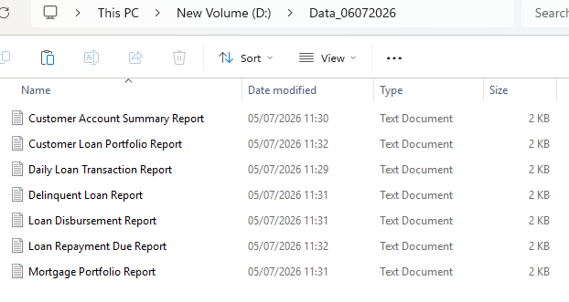 

  - **Parameter Setup**  
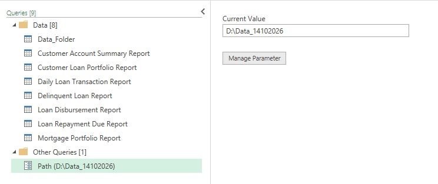 

  - **File Inventory**  
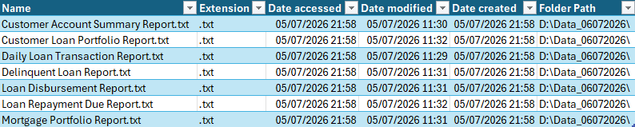 

**Final transformed tables**
  - Output Customer Account Summary Report  
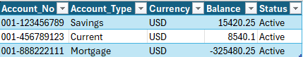

  - Output: Customer Loan Portfolio Report  
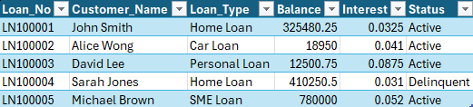

  - Output: Daily Loan Transaction Report  
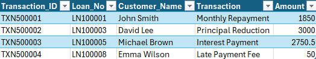

  - Output: Delinquent Loan Report  
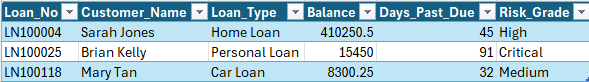

  - Output: Loan Disbursement Report  
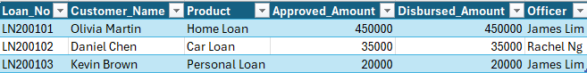

  - Output: Loan Repayment Due Report  
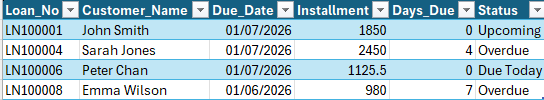

  - Output: Mortgage Portfolio Report  
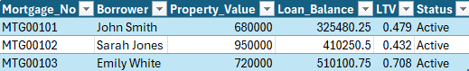

**File Inventory Post Refreshing**
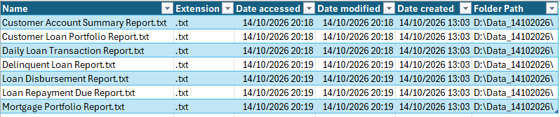

### 10. Power Query steps
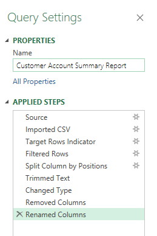

👨‍💻 Author

**Eddie Zhu**  
Data Analyst / Aspiring Actuary
